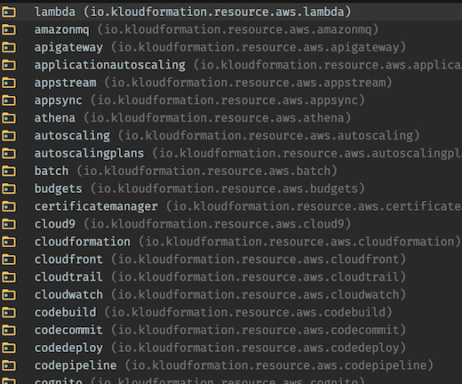
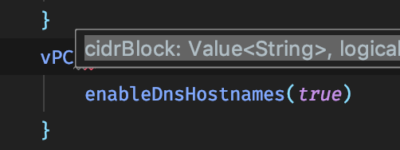

## Table of contents
{: .no_toc .text-delta }

* TOC
{:toc}

# Fundamentals

## Creating a Template

You can create a template by invoking the create method on `KloudFormationTemplate` in the package `io.kloudformation.model`

<pre class="kotlin" data-highlight-only>
fun myStack() = KloudFormationTemplate.create { }
</pre>

Alternatively, if you are implementing `StackBuilder` your stack building method will look like this:

<pre class="kotlin" data-highlight-only>
class Stack: StackBuilder {
    override fun KloudFormation.create() { }
}
</pre>

You can invoke this method by running the main method in `StackBuilder` as part of a build tool like Maven or Gradle (See [Get Started](../get-started/get-started.html#get-started)).

> Within the { } braces you have access to all of KloudFormation

## Creating Resources

Creating resources is covered in detail in the [Resources](../resources.html) section.

To create a resource simply call the builder function for that resource, for example if in CloudFormation the type is `AWS::SNS::Topic` then the function will be called `topic` which will exist in the package `io.kloudformation.resource.aws.sns`.

Every resource has a builder function of the same name.

Here are some of the resource packages

#### Required Resource Properties
{: .no_toc }

The builder function can be invoked by passing any required parameters for that resource inside ( ) brackets

<pre class="kotlin" data-highlight-only>
class Stack: StackBuilder {
    override fun KloudFormation.create() {
        topic() // No required properties
        vPC(cidrBlock = +"0.0.0.0/0") // cidrBlock is required
    }
}
</pre>

#### Not Required Resource Properties
{: .no_toc }

Any properties that are not required appear as functions on the builder for that resource. The builder is passed to you in the last argument. The last argument can be a lambda with { } braces.

<pre class="kotlin" data-highlight-only>
class Stack: StackBuilder {
    override fun KloudFormation.create() {
        bucket {
            bucketName("myBucket") // This property is not required
        }
        vPC(cidrBlock = +"0.0.0.0/0") { // Notice the + here, See the section below on Value&lt;T&gt;
            enableDnsHostnames(true) // This property is not required
        }
    }
}
</pre>

## The Value&lt;T&gt; Type

You will spot the Value type all over KloudFormation. It's simply a way for us to represent any of CloudFormation's types.

For example, `cidrBlock` is a required property of `vpc`. It looks like this in IntelliJ's Code Completion.

`cidrBlock` is a `Value<String>`. In CloudFormation this property is listed as a String. However you can actually provide anything that will result in a String at deploy time. This includes: a String, a resource reference `Ref`, a join `Fn::Join`, a resource attribute `Fn::GetAtt` or any of the other functions in CloudFormation.

The `Value<T>` type allows us to do this in KloudFormation.

To provide a `String` anywhere a `Value<String>` is needed you can use the provided unaryPlus.

<pre class="kotlin" data-highlight-only>
vPC(cidrBlock = +"0.0.0.0/0")
</pre>

Other types can be provided using `Value.Of(...)`

<pre class="kotlin" data-highlight-only>
dBCluster { 
    port(Value.Of(3306))
}
</pre>

In most cases, function overloads are provided with the simple type

<pre class="kotlin" data-highlight-only>
dBCluster { 
    port(3306)
}
</pre>

## The Value&lt;JsonNode&gt; Type

In some places within KloudFormation you will come across the `Value<JsonNode>` type. This occurs anywhere where JSON is expected.

We have provided a `json()` function that allows you to pass a kotlin `Map<String, Any>` that will evaluate to `Value<JsonNode>`.

> For IAM Policies use the `policyDocument()` function, see [IAM Policies](./iamPolicies.html)